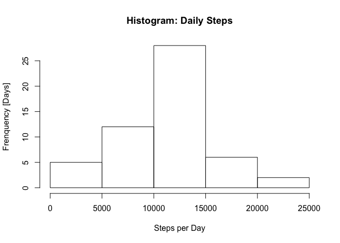
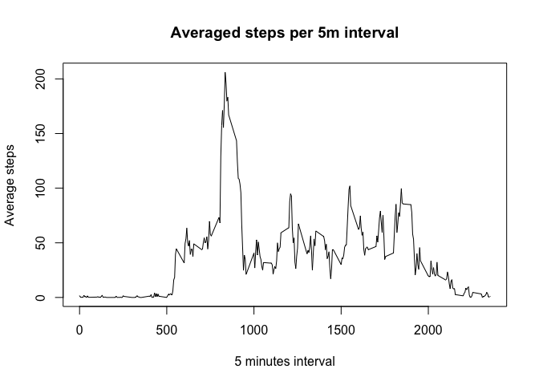
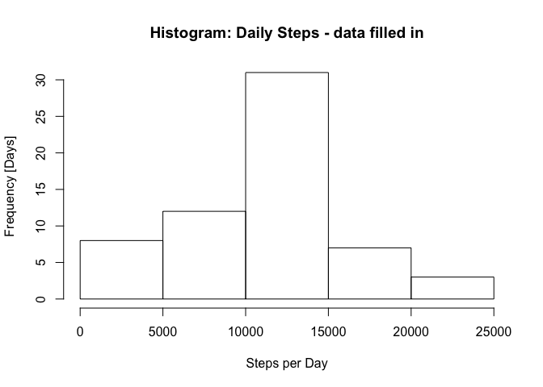
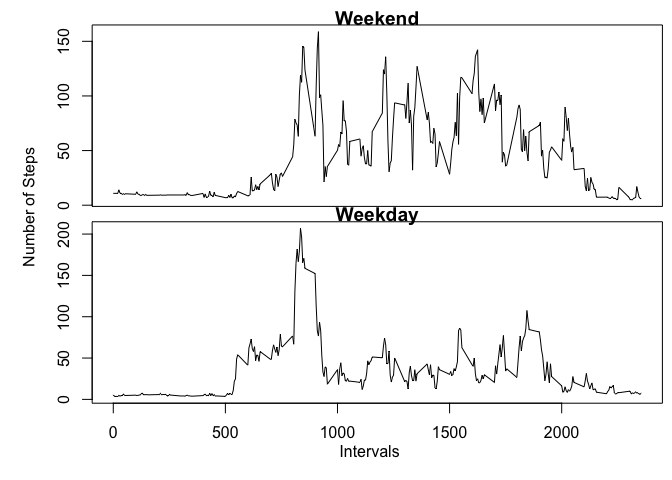

# Reproducible Research: Peer Assessment 1
Luciano Lima  
14 de agosto de 2016  


## Loading and preprocessing the data
1. Loading the data, activity.csv

```r
data<-read.csv("activity.csv")
str(data)
```

```
## 'data.frame':	17568 obs. of  3 variables:
##  $ steps   : int  NA NA NA NA NA NA NA NA NA NA ...
##  $ date    : Factor w/ 61 levels "2012-10-01","2012-10-02",..: 1 1 1 1 1 1 1 1 1 1 ...
##  $ interval: int  0 5 10 15 20 25 30 35 40 45 ...
```

## What is mean total number of steps taken per day?
1. Calculate the total number of steps taken per day.

Created the data frame totalStepsPerDay using the functions group_by and summarize of the library dplyr, showed the summary of it.

```r
library(dplyr)
```

```
## 
## Attaching package: 'dplyr'
```

```
## The following objects are masked from 'package:stats':
## 
##     filter, lag
```

```
## The following objects are masked from 'package:base':
## 
##     intersect, setdiff, setequal, union
```

```r
by_date<-group_by(data,date)
totalStepsPerDay<-summarize(by_date,total=sum(steps),na.rm="TRUE")
summary(totalStepsPerDay)
```

```
##          date        total          na.rm          
##  2012-10-01: 1   Min.   :   41   Length:61         
##  2012-10-02: 1   1st Qu.: 8841   Class :character  
##  2012-10-03: 1   Median :10765   Mode  :character  
##  2012-10-04: 1   Mean   :10766                     
##  2012-10-05: 1   3rd Qu.:13294                     
##  2012-10-06: 1   Max.   :21194                     
##  (Other)   :55   NA's   :8
```

2. Make a histogram of the total number of steps taken each day.

Plot can be seen in the file histStepsPerDay.png

```r
hist(totalStepsPerDay$total, main="Histogram: Daily Steps", xlab="Steps per Day",ylab="Frenquency [Days]")
```

<!-- -->

3. Calculate and report the mean and the median of the total number of steps taken per day.

The mean of steps taken per day is 10766.19 and the median of steps taken per day is 10765.

```r
 mean<-mean(totalStepsPerDay$total,na.rm="TRUE")
mean
```

```
## [1] 10766.19
```

```r
 median<-median(totalStepsPerDay$total,na.rm="TRUE")
 median
```

```
## [1] 10765
```

## What is the average daily activity pattern?

1. Make a time series plot of the 5 minutes interval (x-axis) and the average of steps taken, averaged accross all days (y-axis).

Plot can be seen in the file avgDailyActivity.png

```r
by_interval<-group_by(data,interval)
avgStepsPerInterval<-summarize(by_interval,avg=mean(steps,na.rm="TRUE"))
plot(avgStepsPerInterval$interval,avgStepsPerInterval$avg, type="l",main="Averaged steps per 5m interval",xlab="5 minutes interval", ylab="Average steps")
```

<!-- -->

2. Which 5-minute interval, on average across all the days in the dataset, contains the maximum number of steps?

The 5-minute interval that contains the maximum number of steps averaged across all the days is the interval 835.

```r
highestInterval<-slice(avgStepsPerInterval,which.max(avg))
highestInterval$interval
```

```
## [1] 835
```

## Imputing missing values
1. Calculate and report the total number of missing values in the dataset (i.e. the total number of rows with NAs)

The total number of rows with NAs is 2304.

```r
rowsNa<-sum(is.na(data[,1]))
rowsNa
```

```
## [1] 2304
```

2. Devise a strategy for filling in all of the missing values in the dataset. The strategy does not need to be sophisticated. For example, you could use the mean/median for that day, or the mean for that 5-minute interval, etc.

Used the mean for that 5-minute interval to fill the NA data.

```r
dataNa<-subset(data,is.na(steps)) 
dataNa$steps<-merge(dataNa,avgStepsPerInterval,"interval")$avg
str(dataNa)
```

```
## 'data.frame':	2304 obs. of  3 variables:
##  $ steps   : num  1.72 1.72 1.72 1.72 1.72 ...
##  $ date    : Factor w/ 61 levels "2012-10-01","2012-10-02",..: 1 1 1 1 1 1 1 1 1 1 ...
##  $ interval: int  0 5 10 15 20 25 30 35 40 45 ...
```

3. Create a new dataset that is equal to the original dataset but with the missing data filled in.

Created a row bind between the subset of activity (data) without NAs and the data frame with the mean values(dataNa). 

```r
dataFilled<-rbind(subset(data,!is.na(steps)),dataNa)
str(dataFilled)
```

```
## 'data.frame':	17568 obs. of  3 variables:
##  $ steps   : num  0 0 0 0 0 0 0 0 0 0 ...
##  $ date    : Factor w/ 61 levels "2012-10-01","2012-10-02",..: 2 2 2 2 2 2 2 2 2 2 ...
##  $ interval: int  0 5 10 15 20 25 30 35 40 45 ...
```

4. Make a histogram of the total number of steps taken each day and Calculate and report the mean and median total number of steps taken per day. Do these values differ from the estimates from the first part of the assignment? What is the impact of imputing missing data on the estimates of the total daily number of steps?

Plot can be seen in the file histDataFilled.png

```r
by_dateFilled<-group_by(dataFilled,date)
totalStepsPerDayFilled<-summarize(by_dateFilled,total=sum(steps))
hist(totalStepsPerDayFilled$total, main="Histogram: Daily Steps - data filled in", xlab="Steps per Day", ylab="Frequency [Days]")
```

<!-- -->

After filledin the data, the mean of steps taken per day is 10766.19 and the median of steps taken per day is 11015.

```r
meanFilled<-mean(totalStepsPerDayFilled$total)
meanFilled
```

```
## [1] 10766.19
```

```r
medianFilled<-median(totalStepsPerDayFilled$total)
medianFilled
```

```
## [1] 11015
```

Analysing the histogram and the values of mean and median we noticed that the strategy of filled the data with the average for the period, increased the number of days (Frequency) with steps per day between 10,000 and 15,000. With these strategy we didn't changed the mean, because we used the  mean to fill the NA data. But we increased the median from 10,765 to 11015 steps.

## Are there differences in activity patterns between weekdays and weekends?
1. Create a new factor variable in the dataset with two levels -- "weekday" and "weekend" indicating whether a given date is a weekday or weekend day.

Created the data frame dataFilledDay using the function isWeekday of library timeDate. Showed the summary of it.

```r
library(timeDate)
dataFilledDay<-mutate(dataFilled,day=factor(isWeekday(as.Date(date)),levels=c(FALSE,TRUE),labels=c('weekend','weekday')))
summary(dataFilledDay)
```

```
##      steps                date          interval           day       
##  Min.   :  0.00   2012-10-01:  288   Min.   :   0.0   weekend: 4608  
##  1st Qu.:  0.00   2012-10-02:  288   1st Qu.: 588.8   weekday:12960  
##  Median :  0.00   2012-10-03:  288   Median :1177.5                  
##  Mean   : 37.38   2012-10-04:  288   Mean   :1177.5                  
##  3rd Qu.: 27.00   2012-10-05:  288   3rd Qu.:1766.2                  
##  Max.   :806.00   2012-10-06:  288   Max.   :2355.0                  
##                   (Other)   :15840
```

2. Make a panel plot containing a time series plot (i.e. type = "l") of the 5-minute interval (x-axis) and the average number of steps taken, averaged across all weekday days or weekend days (y-axis).

Plot can be seen in the file panelPlot.png

```r
by_intervalFilledDay<-group_by(dataFilledDay,interval,day)
avgStepsPerIntervalFilledDay<-summarize(by_intervalFilledDay,avg=mean(steps))
par(mfrow = c(2, 1), mar = c(0,0.8,0.8,0), oma = c(4, 4, 0.5, 0.5))
plot(avgStepsPerIntervalFilledDay$interval[avgStepsPerIntervalFilledDay$day=="weekend"],avgStepsPerIntervalFilledDay$avg[avgStepsPerIntervalFilledDay$day=="weekend"], type="l",main="Weekend",xlab="", ylab="",xaxt="n")
plot(avgStepsPerIntervalFilledDay$interval[avgStepsPerIntervalFilledDay$day=="weekday"],avgStepsPerIntervalFilledDay$avg[avgStepsPerIntervalFilledDay$day=="weekday"], type="l",main="Weekday",xlab="", ylab="")
mtext("Intervals", side = 1, outer = TRUE, line=2) 
mtext("Number of Steps", side = 2, outer = TRUE, line=2) 
```

<!-- -->

Analysing the two graphs we can see that the pattern of activities differ in two main points. First, in the weekdays the activities started earlier than in the weekend. Second, in the weekend we have more activities spreaded in the 5-minute intervals of the the day than in the weekdays. Looking at the graphs, it's visible that we have more activity in the weekends.


